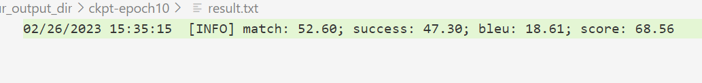
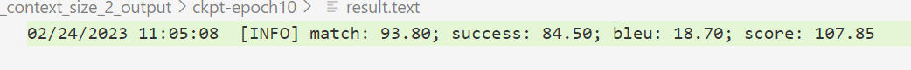
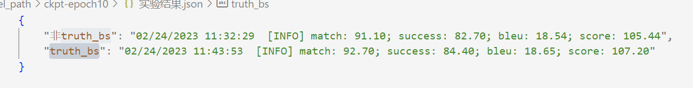
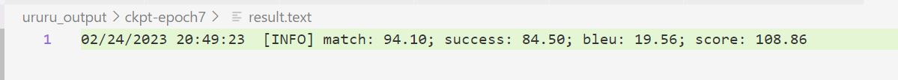

##### 训练命令

```bash
CUDA_VISIBLE_DEVICES=1 python3 main.py -version 2.1 -run_type train -backbone ./model_path/ -model_dir ./output_dir -batch_size 4

CUDA_VISIBLE_DEVICES=1 python3 main.py -version 2.1 -run_type train -backbone ./model_path/ -model_dir ./sum_ws_4_dir -context_size 5 -batch_size 8 -ururu -add_summary_cross_attention
```

##### 推理命令

```bash
CUDA_VISIBLE_DEVICES=1 python3 main.py -run_type predict -ckpt ./model_path/ckpt-epoch10/ -output predict.json -batch_size 8
```


##### 仅用user + resp作为对话历史输入模型 -- 对话历史窗口大小2

###### MTTOD 仅bs与resp联合训练(不包含auxiliary_task)



###### OURS 仅summary与resp联合训练(不含cross_attention)



##### 用user + bs + db + ac + resp作为对话历史输入模型 -- 全部对话历史

###### MTTOD 仅bs与resp联合训练(不包含auxiliary_task)



##### 仅用user + resp作为对话历史输入模型 -- 对话历史窗口大小4

###### OURS 仅summary与resp联合训练(不含cross_attention)



```python
"""
   MTTOD: model.py

   implements MTTOD model, with huggingface transformers module.

   Copyright 2021 ETRI LIRS, Yohan Lee
   Copyright 2018- The Hugging Face team. All rights reserved.

   Licensed under the Apache License, Version 2.0 (the "License");
   you may not use this file except in compliance with the License.
   You may obtain a copy of the License at

       http://www.apache.org/licenses/LICENSE-2.0

   Unless required by applicable law or agreed to in writing, software
   distributed under the License is distributed on an "AS IS" BASIS,
   WITHOUT WARRANTIES OR CONDITIONS OF ANY KIND, either express or implied.
   See the License for the specific language governing permissions and
   limitations under the License.
"""


import copy

import torch
from torch import nn
from torch.nn.utils.rnn import pad_sequence
from transformers import T5ForConditionalGeneration, T5EncoderModel
from transformers.modeling_outputs import Seq2SeqLMOutput

from utils import definitions


class T5WithSummary(T5ForConditionalGeneration):
    def __init__(self, config):
        super(T5WithSummary, self).__init__(config)
    
        decoder_config = copy.deepcopy(config)
        decoder_config.is_decoder = True
        decoder_config.is_encoder_decoder = False
        
        decoder_config.add_summary_cross_attention = True
        decoder_config.summary_attention_layers = 6

        self.add_summary_cross_attention = decoder_config.add_summary_cross_attention
        self.summary_attention_layers = decoder_config.summary_attention_layers

        self.resp_decoder = type(self.decoder)(decoder_config, self.shared)
        self.resp_lm_head = type(self.lm_head)(
            config.d_model, config.vocab_size, bias=False)

        self.dropout = nn.Dropout(config.dropout_rate)

    def initialize_additional_decoder(self):
        decoder_config = copy.deepcopy(self.config)
        decoder_config.is_decoder = True
        decoder_config.is_encoder_decoder = False
        decoder_config.add_summary_cross_attention = self.add_summary_cross_attention
        decoder_config.summary_attention_layers = self.summary_attention_layers

        self.resp_decoder = type(self.decoder)(decoder_config, self.shared)
        self.resp_lm_head = type(self.lm_head)(
            self.config.d_model, self.config.vocab_size, bias=False)

        self.resp_decoder.load_state_dict(self.decoder.state_dict(), strict=False)
        self.resp_lm_head.load_state_dict(self.lm_head.state_dict())

    def initialize_weights(self, modules):
        for module in modules:
            if isinstance(module, (nn.Linear, nn.Embedding)):
                module.weight.data.normal_(mean=0.0, std=0.02)
            elif isinstance(module, nn.LayerNorm):
                module.bias.data.zero_()
                module.weight.data.fill_(1.0)
            if isinstance(module, nn.Linear) and module.bias is not None:
                module.bias.data.zero_()

    def prepare_inputs_for_generation(self, input_ids,
                                      past=None, attention_mask=None,
                                      use_cache=None, encoder_outputs=None,
                                      **kwargs):
        if past is not None:
            input_ids = input_ids[:, -1:]

        return {"decoder_input_ids": input_ids,
                "past_key_values": past,
                "encoder_outputs": encoder_outputs,
                "attention_mask": attention_mask,
                "use_cache": use_cache,
                "decoder_type": kwargs.get("decoder_type"),
                "summary_hidden_states": kwargs.get("summary_hidden_states"),
                "summary_attention_mask": kwargs.get("summary_attention_mask")}

    def forward(self,
                input_ids=None,
                attention_mask=None,
                decoder_input_ids=None,
                encoder_outputs=None,
                summary_hidden_states=None,
                summary_attention_mask=None,
                past_key_values=None,
                inputs_embeds=None,
                decoder_inputs_embeds=None,
                lm_labels=None,
                use_cache=None,
                output_attentions=None,
                output_hidden_states=None,
                return_dict=None,
                encoder_only=None,
                decoder_type=None):

        use_cache = use_cache if use_cache is not None else self.config.use_cache
        return_dict = return_dict if return_dict is not None else self.config.return_dict

        if encoder_outputs is None:
            encoder_outputs = self.encoder(input_ids=input_ids,
                                           attention_mask=attention_mask,
                                           inputs_embeds=inputs_embeds,
                                           return_dict=return_dict)

            if return_dict:
                encoder_hidden_states = encoder_outputs.last_hidden_state
            else:
                encoder_hidden_states = encoder_outputs[0]

            hs = encoder_hidden_states * (self.model_dim ** -0.5)

        else:
            if isinstance(encoder_outputs, tuple):
                encoder_hidden_states = encoder_outputs[0]
            else:
                encoder_hidden_states = encoder_outputs.last_hidden_state

        if encoder_only:
            return encoder_outputs

        if lm_labels is not None and decoder_input_ids is None and decoder_inputs_embeds is None:
            decoder_input_ids = self._shift_right(lm_labels)

        if decoder_type == "resp":
            decoder = self.resp_decoder
            lm_head = self.resp_lm_head

        else:
            decoder = self.decoder
            lm_head = self.lm_head

        if past_key_values is not None:
            assert lm_labels is None, "Decoder should not use cached key value states when training"
            if decoder_input_ids is not None:
                decoder_input_ids = decoder_input_ids[:, -1:]
            if decoder_inputs_embeds is not None:
                decoder_inputs_embeds = decoder_inputs_embeds[:, -1:]

        if decoder_type == 'resp':
            decoder_outputs = decoder(input_ids=decoder_input_ids,
                                    inputs_embeds=decoder_inputs_embeds,
                                    past_key_values=past_key_values,
                                    encoder_hidden_states=encoder_hidden_states,
                                    encoder_attention_mask=attention_mask,
                                    summary_hidden_states=summary_hidden_states,
                                    summary_attention_mask=summary_attention_mask,
                                    use_cache=use_cache,
                                    return_dict=return_dict)
        else:
            decoder_outputs = decoder(input_ids=decoder_input_ids,
                                    inputs_embeds=decoder_inputs_embeds,
                                    past_key_values=past_key_values,
                                    encoder_hidden_states=encoder_hidden_states,
                                    encoder_attention_mask=attention_mask,
                                    use_cache=use_cache,
                                    return_dict=return_dict,
                                    output_hidden_states=output_hidden_states)

        sequence_output = decoder_outputs[0]

        sequence_output = sequence_output * (self.model_dim ** -0.5)

        lm_logits = lm_head(sequence_output)

        lm_loss = None
        if lm_labels is not None:
            lm_loss_fct = nn.CrossEntropyLoss(ignore_index=0)
            lm_loss = lm_loss_fct(
                lm_logits.view(-1, lm_logits.size(-1)), lm_labels.view(-1))

        # for training
        if not return_dict:
            pred_lm = torch.argmax(lm_logits, dim=-1)
            outputs = (lm_loss, pred_lm,) + \
                (encoder_hidden_states, sequence_output)

        # for prediction
        else:
            outputs = Seq2SeqLMOutput(
                loss=lm_loss,
                logits=lm_logits,
                past_key_values=decoder_outputs.past_key_values,
                decoder_hidden_states=decoder_outputs.hidden_states,
                decoder_attentions=decoder_outputs.attentions,
                cross_attentions=decoder_outputs.cross_attentions,
                encoder_last_hidden_state=encoder_outputs.last_hidden_state,
                encoder_hidden_states=encoder_outputs[1] if len(
                    encoder_outputs) > 1 else None,
                encoder_attentions=encoder_outputs[2] if len(encoder_outputs) > 2 else None)

        return outputs

```

