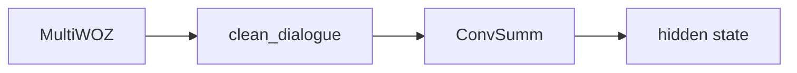
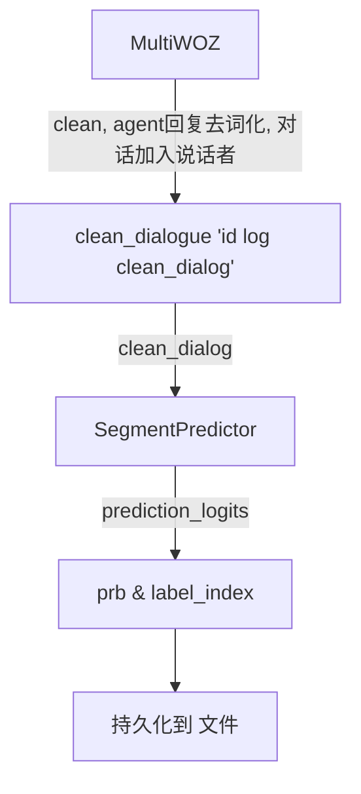

###### 3. 




###### ConvSumm模型 segment_label 没用分类预测的结果？？？

###### 如何形成Example？？？

#### SegmentPredict

CovSumm分段预测的效果并不好

##### 1. segment训练部分

1. ConvSumm Segment训练 部分

> `project`: /home/jhr/CODS/ConvSumm-master/CODS
>
> `virtualenv`: cods(二卡)
>
> ```python
> python train_segmemt_predictor.py --do_train --data_dir=SAMsum/clean_data/ --output_dir=save/train_segment_predictor/
> ```

2. MultiWOZ Segment训练 部分

`project`: /home/jhr/work

`virtualenv`: cods(二卡)

```python
python train_segmemt_predictor.py --do_train  --output_dir=save/segment_predictor/
```

##### 2. segment预测部分

`project`: /home/jhr/work

`virtualenv`: cods(二卡)

将训练保存的模型复制到 `--load_path` 下

```python
python train_segmemt_predictor.py --output_dir=./save/segment_predictor --load_path=./save/segment_predictor/pytorch.bin
```




##### 分类predict阶段

```python
def dump_segment(args, data_type, base_model, evaluate_dataloader):
    print("[INFO] Dump Segment Label...")
    
    base_model.eval()
    out_data = {}
    softmax_layer = nn.Softmax(-1)
    for eval_data in tqdm(evaluate_dataloader):
        eval_prediction_logits = base_model(eval_data)  # batch_size list of [turn_nums, label_nums]
        eval_prediction_logits_cat = torch.cat(eval_prediction_logits, 0)
        eval_probs = [softmax_layer(logit) for logit in eval_prediction_logits]
        eval_prediction = [prob.topk(1, dim=-1) for prob in eval_probs]

        #当前batch中的 index
        for i, _id in enumerate(eval_data["id"]):
                
            segment_prob, segment_label = [], []
            for prob in torch.squeeze(eval_prediction[i].values).cpu().tolist():
                segment_prob.append(prob)
            for index in  torch.squeeze(eval_prediction[i].indices).cpu().tolist():
                segment_label.append(index)
            
            out_data[_id] = {
                "segment_label": segment_label,
                "segment_prob": segment_prob
            }
    
    with open(os.path.join(args.output_dir, "{}.json".format(data_type)), "w") as fout:
        json.dump(out_data, fout, indent=4)
    
    return out_data
```

#### SummaryPredict

##### 1.Summary 训练部分

`project`:  /home/jhr/CODS/ConvSumm-master/CODS

`virtualenv`: cods(二卡)

用开方域数据集进行训练

```python
python hf_train_bart.py --do_train --do_segment --output_dir=save/bart-large-xsum-samsum-segment --train_batch_size=2 --eval_batch_size=4
```

e4d3cce2bf5c14a2497d3c498252d9b938e3ce35
#### Idea

###### 1. 对话角色信息

通过显示的在对话前加上说话者标识符，进行训练。

期望得到具有角色信息的回复。

结合ConvSumm的工作

###### 2. 将原本结构化的对话动作转化为非结构化的自然语言隐向量指导回复生成

###### 3. 多领域任务型对话，往往每个领域之间分界清晰，通过DA做标签分Segment  `领域识别任务`

###### 4. data.json 中的message 提取标签

message主要是为标注者提供本轮对话的任务需求
